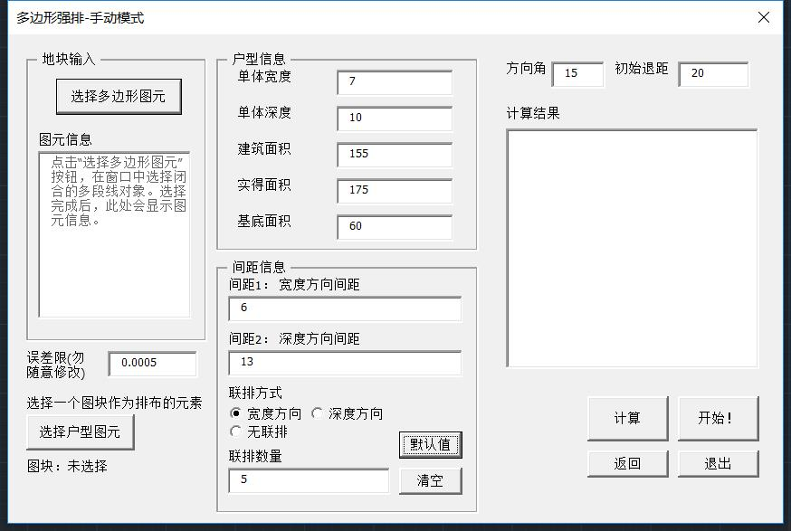
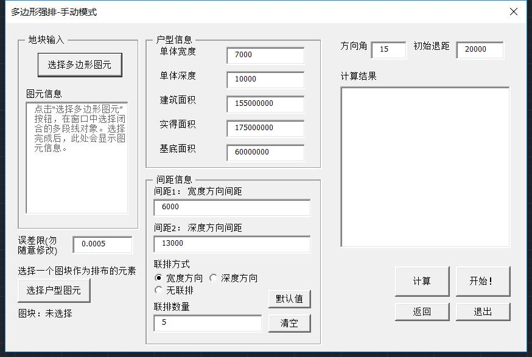
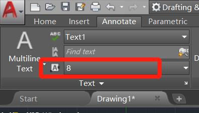
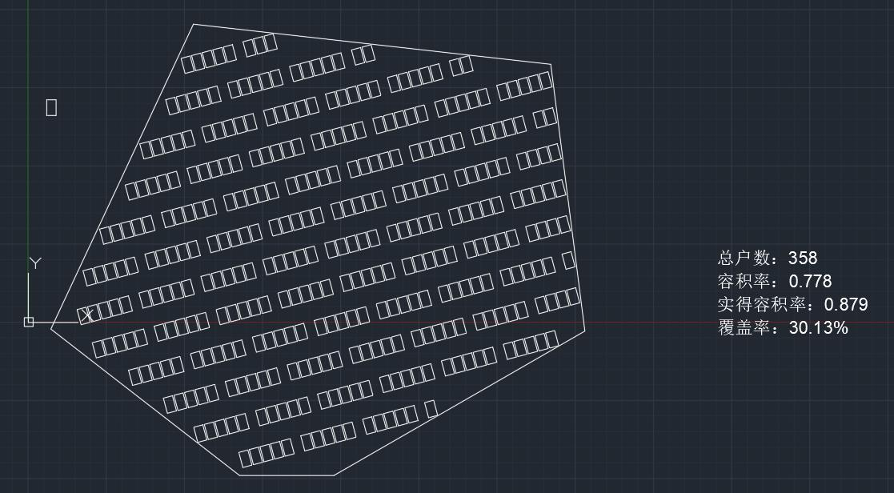

## 强排小程序 V1.1 更新说明

### 2019.1.30

##### 修复：

1. 修复了【无联排】模式数据不准的问题
2. 【无联排】模式下，联排数量可以任意设置，不影响结果
3. 【联排数量】设置为0或者1的时候，自动进入无联排模式

##### 注意：

尽量将地块放在CAD绘图空间的第一象限（x,y均为正），否则有可能会出bug，原因暂时不明

### 2019.1.26

#### 1. 绘图与数据单位问题

* 取消了绘图单位，所有数据均无量纲。

* 新版本输入数据时，注意保持单位一致：

  * 注意 1m = 1000mm，1m^2 = 1000000 mm^2 
  * 如果以“m”为单位绘图，则应当以“m”为单位输入：

  

  * 如果以“mm”为单位绘图，则以“mm”为单位输入：

  

  

#### 2. 数据输出

* 新版本可以自动将算出的数据输出在模型空间，以“多行文字(MTEXT)”的形式

* 输出多行文字的格式：与当前激活的多行文字格式相同：

  

* 输出多行文字的位置：根据地块的尺寸自适应，总是位于地块正右侧四分之一处，文字区域宽度等于地块宽度的一半

* 输出示例：

  

#### 3. 其它更新

* 修复了经常出现的index溢出bug

* 修复了选择户型后户型块丢失的bug

* 点击“开始”按钮就可以马上出现排好的图形

* 略微优化了核心算法

  

乔天扬

2019.1.26